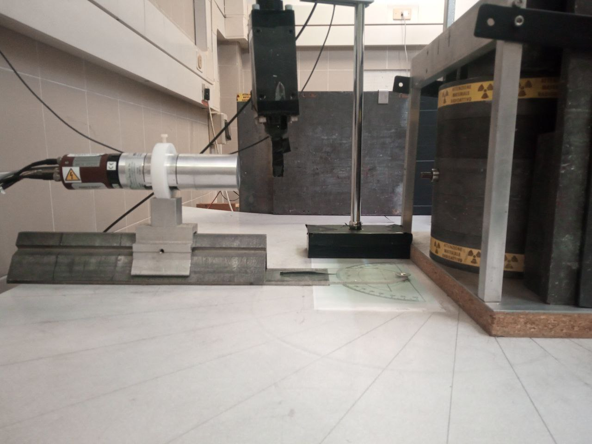

# Logbook esperinza Compton
## 12 aprile 2022
### Punto 1
Stima limite superiore di dose equivalente:
* 73 nSv/s
* 9.3 mSv per il periodo totale di acquisizione

### Ingresso in laboratorio
Iniziamo a familiarizzare con la strumentazione:
* alimentatore CAEN N471, ha due canali di cui è possibile settare e monitorare la tensione di alimntazione, la corrente e la tensione massima.
* PMT1 alimentato positivamente dal canale A dell'alimentatore ad alta tensione
* PMT2 alimentato negativamente dal canale B 

**what?** osseviamo senza aver settato niente il segnale uscente dal PMT1, quando togliamo il cilindretto che blocca la radiazione della sorgente, la frequenza di trigger passa da il centinaio di hertz a sotto la decina... noi ci saremmo aspettati il contrario
**risposta** è la schifezza che viene fuori dallo scattering col tappo

Impostiamo delle tensioni di alimentazioni consigliate e scegliamo le tensioni di soglia in modo che segnali aventi forme d'onda diverse da quella aspettata siano disciminati.

| Vmon1 | Vmon2 | VTHR1 |
| --------------- | --------------- | --------------- |
| 670 V           | 1510 V          | -207.8 mV       |

Controlliamo il funzionamento del PMT1 con punto di lavoro fissato come sopra e $\theta=0$.
A VTHR1 = 207.8 mV vediamo un rate di 0.7 Hz (anche cambiando l'angolo), quando ce ne aspettiamo uno di 74 MBq
A VTHR1= 68.3 mV il rate è di 16 Hz (3Hz per un angolo di 45$^\circ$).

Andiamo a vedere che energie legge il PMT1a in diverse configurazioni: cambiando la tensione di alimentazione(, la tensione di soglia?), la distanza dalla sorgente.
Prendiamo il segnale PMT1a, lo inviamo all'attenuatore passivo con una attenuazione di 20 dB, il segnale attenuato passa dal TENNELEC che aggiusta la forma d'onda in modo tale che sia compatibile con il modulo ADC CAEN, che misura l'energia dell'evento.
L'attenuatore serve perchè il segnale satura nel TENNELEC per tensioni superiori a 4.84 V (cursori)

| Vmon1 [V] | VTHR [mV] | D [cm] | name_file.dat |
| -------------------- | -------------------- | ------ | ------------- |
| 670                  | -68.3                |        |               |

### lista di domande
* le ripartenze sono un problema?

## 13 aprile 2022
Il rate che osservavamo era basso perché la soglia di trigger era troppo alta, per alimentazioni più basse serve una soglia più bassa, e.g. Vmon = 757 V  e VTR = -20.0 mV, rate ad angolo zero è 9 KHz, ad angolo 30 è 200 Hz, attenuazione 23dB.

D è la distanza tra l'inizio della guida e l'inizio del carrello. 
La distanza tra:
* l'inizio del carrello e l'inizio del cristallo è 7.3(2) cm,
* l'inizio della guida e la vite è 22.8(2) cm, 
* la vite e il foro è 4.7(2) cm

 
 
    
Disegnamo sul carrello delle tacchette distanti 1 cm a partire dal bordo più vicino al foro (si fanno 21 segni con un pennarello STAEDTLER permanent Lumacolor F).

Note sulla ultima parte in compagnia del professore Dell'Orso:
1. fissiamo D= 0 cm e per vari valori di Vmon andiamo a regolare l'attenuazione per ottenere la massima risoluzione evitando che il TENNELEC saturi in corrispondenza dei picchi dei fotoni. Scriviamo i punti di lavoro buoni.
    | Vmon [V] | coarse gain | fine gain | attenuazione [dB] |
    | ------------------- | ----------- | --------- | ----------------- |
    | 634                 | 10          | 0.85      | --                |
    | 648                 | 10          | 0.942     | 2                 |
    | 688                 | 10          | 0.738     | 6.5               |

2. La configurazione a riga 2 è accettabile.
3. Le terminazioni a 50$\Omega$ ammazzavano il segnale. Il percorso seguito dal segnale per i dati in tabella è:
PMT1amp $\rightarrow$ Attenuatore $\rightarrow$ TENNELEC $\rightarrow$ CAEN N957.

## 26 aprile
 Fissiamo il putno di lavoro del PMT1:
 Vmon = 649 V, corse gain=10, fine gain = 0.942, attenuazione = 1.5 dB.
 
 Misuraimo la variazione di rate diretto (theta = 0) com e senza PMT2:
 senza PMT2 7.5 kHz, con 7.3 kHz (soglia di trigger = -8 mV)
 
 Faccimao un campionamento a diversi angoli dei fotoni incidenti:
 soglia di trigger dell'oscilloscopio -8.0 mV
 | angolo [deg] | rate [Hz] |
 | ------------ | --------- |
 | 0            | 7.5(5) k  |
 | 6            | 3.3(3)k   |
 | 12           | 440(100)  |
 | 30           | 280(40)   |
 | 60           | 200(40)   |
 
 Fissiamo Vmon del PMT2 a 1570 V (il rate misurato all'oscilloscopio a questa tensione è 180(40)Hz con una soglia di -11 mV)
 
 Inviamo al GATE del CAEN N957 l'uscita PMT1b modificata dal discriminatore (soglia -35.1 mV) e da un QUAD GATE (per allargare il segnale): largezza del segnale 10 us, in anticipo rispetto al picco PMT1a di 4.3 us, e dopo il picco passano altri 5.7 us.
 Inviamo al IN del CAEN N957 l'uscita del PMT1a: si vedono i due picchi del Co.
 Aumentando in valore assoluto questa soglia, i picchi venivano mano a mano mangiati

 Poiche' siamo al limite inferiore della soglia del discriminatore proviamo a cambiare il punto di lavoro del PMT1 aumentando Vmon<\sub>.
 Allora fissiamo il punto di lavoro del PMT1 a Vmon = 689 V, corse gain=10, fine gain = 0.732, attenuazione = 5.5 dB.
 Fissiamo il punto di lavoro del PMT2 a Vmon = 1632 V (facendo la stessa considerazine di prima di variazione del rate del PMT1 con e senza targhetta). Ora la soglia del discriminatore è 41.6 e 36.5 rispettivamente per PMT1 e PMT2.
 
 Facciamo la coincidenza tra il PMT1b e PMT2. I segnali sono prima discriminati (come sopra) e successivamente allargati entrambi a 10 us. Si prende l'uscita del modulo di coincidenza OUT e si allrga in modo tale che sia largo 10 us, e che preceda e segua il picco del PMT1a di almeno 200 ns (non è fisso).
 
 * Misuriamo le dimensioni del fascio di fotoni diffusi -> per fare questo non serve prima aggiustare il trigger??)
 * coincidenza PMT1b e PMT2
 * soglia del gate (per fotoni incidenti o fotoni diffusi?)
 
 
 ## 27 aprile
 
 Collego l'uscita del PMT1b all'oscilloscopio con un cavo da 4 ns senza terminazione, si osservano delle riflessioni di 97(1)ns.
 Faccio la stessa cosa con il PMT2 (stesso cavo) e osservo delle riflessioni di 62.00(40) ns. Si osserva che per questo canale ci sono le stesse riflessioni anche con la terminazione a 50 ohm anche se più attenuate.
 
 Da queste misure si può ricavare che la lunghezza del filo che va dal PMT1 all'uscita PMT1b sul track è di 44.5 ns, e quella che va dal PMT2 alla sua uscita sul track è di 27 ns.
 Allora la differenza di tempo di due segnali simultanei sui due PMT è di 17.5 ns.

 I due segnali non sono simultanei (anche se si potrebbe fare una stima teorica di questa differenza) e soprattutto non conosciamo i tempi di risposta dei due PMT, allora ha più senso guardare i due segnali in persistenza all'osscilloscopio e stimare così il ritardo tra le due risposte (comprese di cavi, momento in cui passa la particella dal rivelatore e risposta dello stesso).
 
 Ci sono pochi segnali, percio' si abbassano le soglie del discriminatore al minimo, -35.2 per PMT1b e -36.6 mV per PMT2.
 Abbiamo guardato se si vedevano più coincidenze con una tensine di alimentazione del PMT1 più alta ma poi l'abbiamo reimpostata a 690 V.
 
 Cerchiamo di eliminare le ripartenze del PMT1b, inviamo il segnale del PMT al discriminatore con soglia -35.2 mV, e inviamo il segnale a un dual timer che lo allarga fino a circa 800 ns, e poi lo riduce a 200 ns.
 Il seganle del PMT2 invece è mandato al discriminatore con soglia -36.6 mV, e poi è ritardato di 108 ns e allargato a 324 ns con un modulo quad gate delay.

 Aumentiamo l'alimentazione del PMT2 a 1891 V.
 
 Facciamo la coincidenza tra i due seganli modificati come sopra, ed essa viene allargata a 1 us con il modulo quad gate
 Iniziamo a salvare un file di eventi triggerati sulla coincidenza tra così fatta. Il nome del file è plot0427.log, l'angolo del cristallo è 34 gradi.
 
 ## 28 aprile
 
 Avviamo il progrmma per fare una presa dati con le stesse condizini di ieri: plot0428_1890.dat
 
 Abbassiamo la tensione di alimentazione del PMT2 a 1790 V (dato che la tensione massima è 1800 V).
 Amplifichiamo di un fattore 10 il segnale del PMT2 prima di mandarlo al discriminatore, la cui sogli aviene alzata a -150 mV (così che la soglia di discriminazione sul segnale non ambplificato sia di -15 mV).
 Le larghezze dei due segnali in coincidenza sono di 1 us.
 
 Iniziamo una run con queste condizioni (avendo controllato che la coincidenza fosse ancora corretta): plot0428th30.log.
 
<image src="plots/plot0428th30.pdf"/>
 
 Ne facciamo un'altra con il cristallo ad angolo 15 gradi: plot0428th15.log
 
 
 
 Amplifichiamo anche il PMT1b, con lo scopo di abbassare la sua tensione di soglia così da poter vedere uno spettro più ampio in energia.
 Questa run è salvata nel file plot0428th15bis.log
 
 
 
## 3 maggio
 Briefing:
 * calibrazione per fare osservazioni quantitative su dove mi aspetto di trovare i picchi
 * conoscere la risoluzione dell'apparato (con sorgenti diverse, come quelle con un solo picco)
 * presa dati di un paio d'ore per fare delle considerazioni quantitative e sull'importanza del rumore
 * misura del rumore (?)
 
 Usando l'equazione dell'effetto compton ci si aspetta le seguenti energie per i fotoni scatterati ad angolo theta:
 | theta     | 0    | 15   | 30   |
 | --------- | ---- | ---- | ---- |
 | E_1 [MeV] | 1.17 | 1.08 | 0.89 |
 | E_1 [MeV] | 1.33 | 1.22 | 0.99 |
 
 Facciamo una prima calibrazione usando la sorgente di cobaldo diretta sul cristallo (theta=0), ci aspettiamo due picchi: uno a 1 MeV e uno a 1.2 MeV. Vediamo che il grafico satura sul secondo picco: decidiamo di cambiare il fine gain (del PMT1) a 0.700 (Vmon = 690 V).
 I dati di questo istogramma sono salvati sul file plot0503cal60Co.dat (trigger automatico).
 Il primo picco è 6457(192), il secondo è 7281(188).
 
 Facciamo una presa dati a 15 gradi col setup così fatto (gate quello della volta scorsa, con i segnali dei due PMT in coincidenza sono entrambi amplificati e il fine gain del cristalllo modificato come sopra): plot0503th15_0.dat  e plot0503th15_1.dat (quest'ultimo comprende i dati del primo: è stata messa in "pausa" l'acquisizione).
 
## 4 maggio
 Misuro il diametro del cristallo col calibro: 5.860(5) cm.
 Questo mi serve per determinare l'apertura angolare rispetto alla distanza del cristallo dal foro della sorgente.
 Il PMT2 è largo 1.180(5) cm.
 
 Da oggi in poi iniziamo una procedura di controllo dei punti lavoro e della calibrazione:
 * punti di lavoro
    | Vmon1 [V] | coarse gain PMT1a | fine gain PMT1a | attenuazione [dB] PMT1a | Vmon2 [V] | V_th1b    | V_th2     |
    | -------------------- | ----------------- | --------------- | ----------------------- | -------------------- | --------- | --------- |
    | 690                  | 10                | 0.700           | 5.5                     | 1788                 | -259.5 mV | -151.8 mV |
 * calibrazione
   * sodio: plot0504calNa.dat, plot0504calNa_1.dat
   * cesio: plot0504calCs.dat
 
 Si osserva che se la scatola con le sorgenti non viene schermata dal Pb, il picco del Cesio si vede sempre, in quanto la scatola non è sufficiente a schermarne i fotoni.
 
 Iniziamo una presa dati a 15 gradi: plot0504th15.dat (1h55). 
 Nel frattenpo si fa un'analisi approssimativa () dei dati di calibrazione:
 * sodio due picchi : 6381(187) e 2637(96) (Na)
 * cesio un picco in due grafici : 3414(107) (Cs), 3394(119) (Na)
 * picco osservato nello spettro del cesio in 1014(150) (Cs) --> chi è??
 
 ## 5 maggio

 Procedure iniziali:
 * punto di lavoro
  abbiamo cambiato multimetro (usato per misurare le tensioni di discriminazione)
    | Vmon1 [V] | coarse gain PMT1a | fine gain PMT1a | attenuazione [dB] PMT1a | Vmon2 [V] | V_th1b    | V_th2     |
    | -------------------- | ----------------- | --------------- | ----------------------- | -------------------- | --------- | --------- |
    | 693                  | 10                | 0.700           | 5.5                     | 1790                 | -258.0 mV | -151.0 mV |
 
 
 Abbiamo stretto i segnali che erano in coincidenza a 300 ns.
 Facciamo così un'acquisizione a 15 gradi: plot0505th15d01.dat (0h17).
 
 
 
 Allontanizmo il carrello di 12 cm (prima era a un centrimetro dall'iniziono della guida) e facciamo un'altra acquisizione: plot0505the15d13.dat (0h17).
 
 
 
 Stringiamo ancora i segnali in coincidenza entrambi a 152 ns, e faccimao partire l'acquisizione: plot0505th15d01_01.dat (0h17).
 
 
 
 Facciamo due misure di calibrazione col sodio (plot0505calNa.dat) e col Cesio (plot0505calCs.dat).
